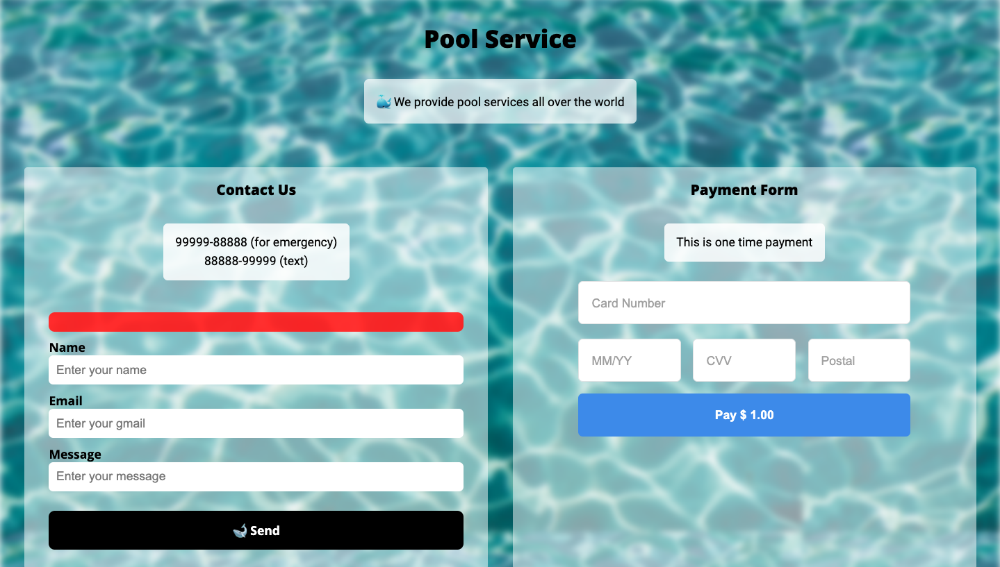
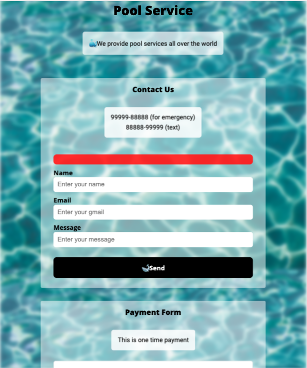
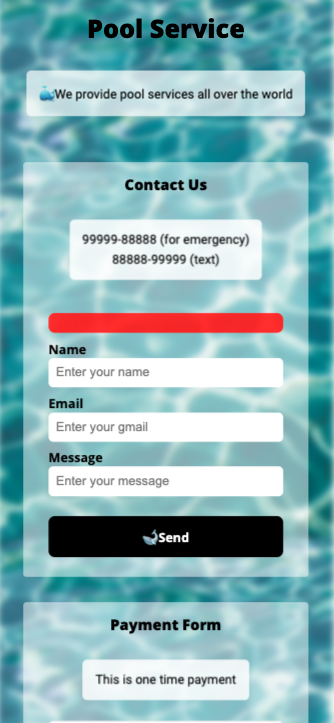
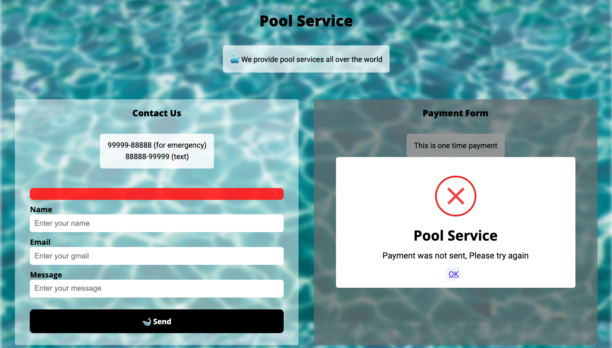
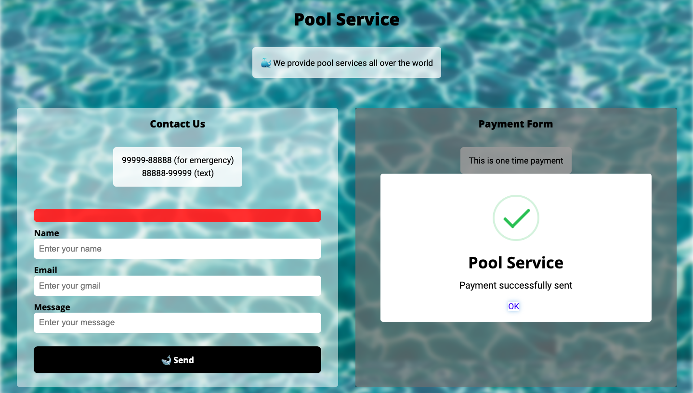
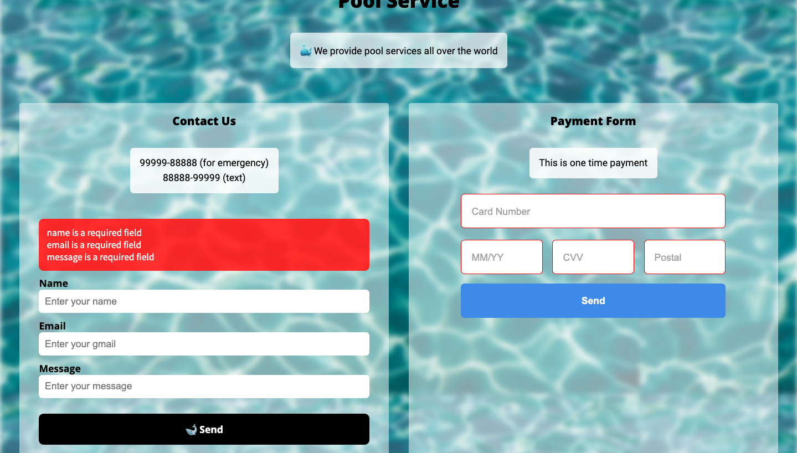
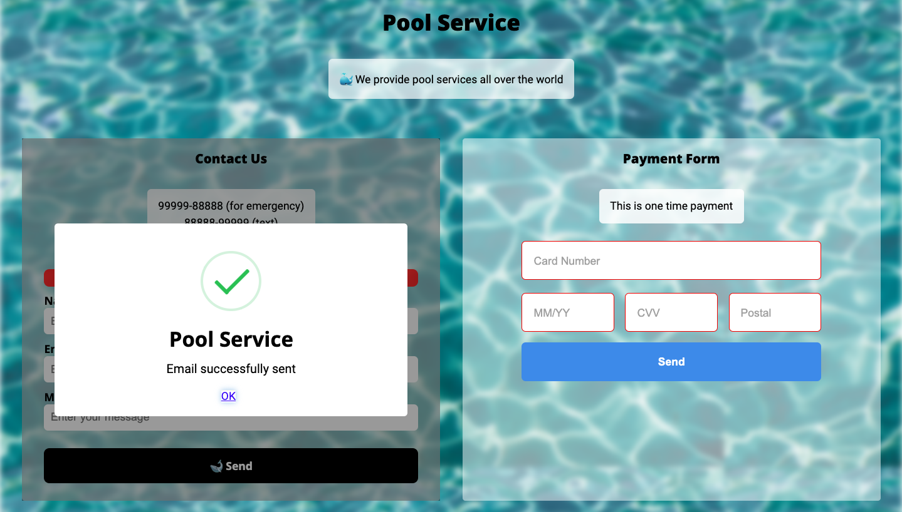

# pool_service

## 🎯 Project goal

- The project was to create a responsive web app with Square Payment Gateway integration and email system by which customers can tell their queires.

## 🔥 Features/Services it provides

- 👉 Payment service (Square Payment Gateway)
- 👉 Responsive web UI
- 👉 Email service (user can ask queires)

## 🍕 Solution

- ✅ Next js with TypeScript is used for built this web
- ✅ Sass is used for styling
- ✅ The payment gateway and email service is handled by api built using next js

## Images

